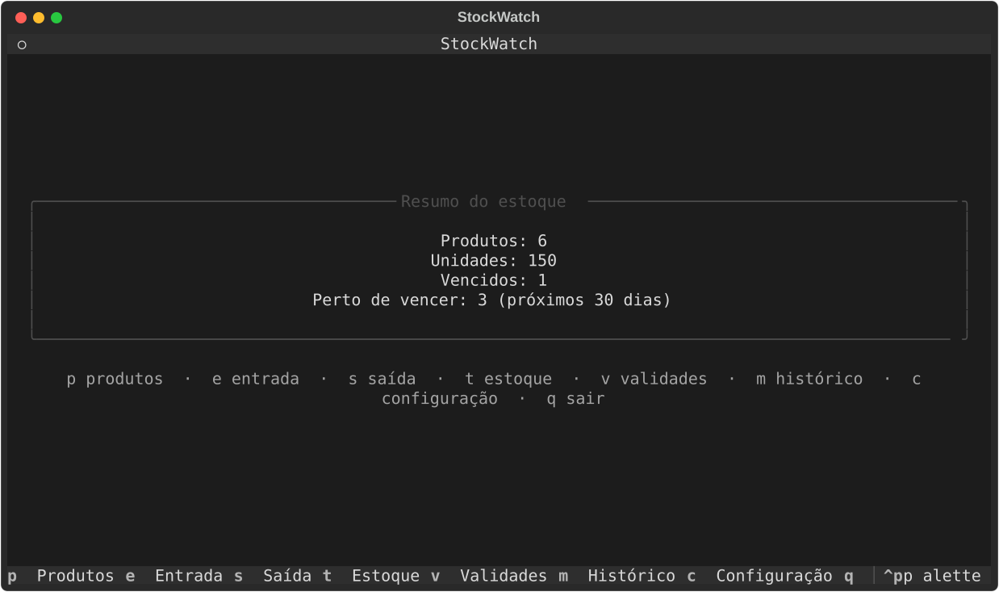
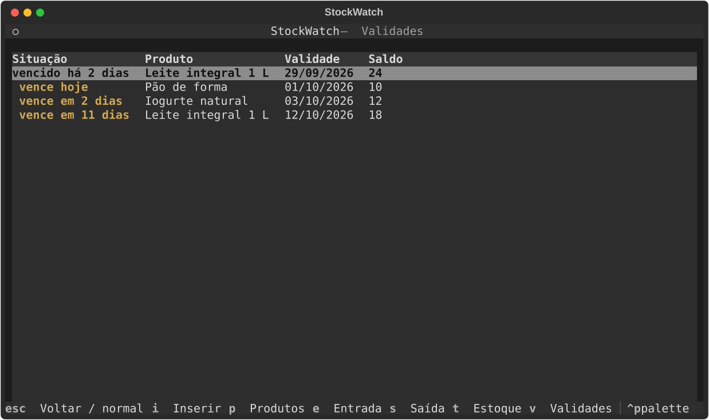
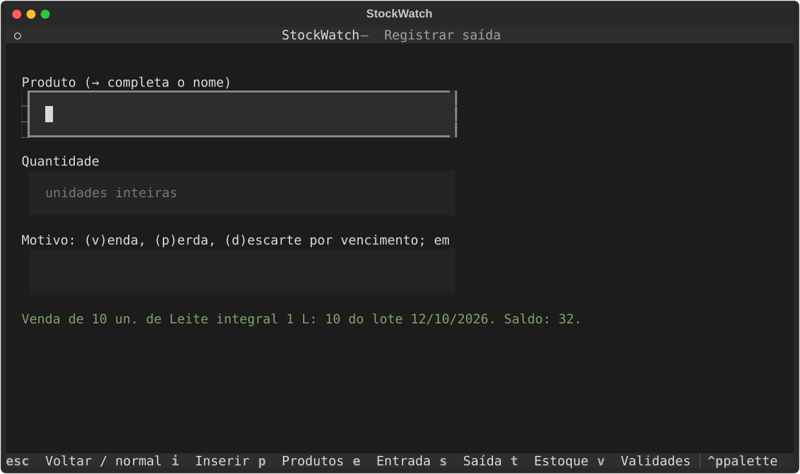

# StockWatch

Controle de estoque e validade com interface de terminal (TUI) para pequenos comércios: entradas por lote, saídas por **FEFO** (*First Expired, First Out*), alertas de vencimento e histórico, tudo local, rápido e operável só pelo teclado.



## Funcionalidades

- **Produtos:** cadastro, edição e exclusão, com categoria opcional. Um produto com histórico não pode ser excluído, para preservar o estoque passado.
- **Entradas:** cada entrada cria um lote, com validade (opcional: em branco, o lote não vence) e fornecedor.
- **Saídas por FEFO:** sai primeiro o lote que vence antes.
  - Uma **venda** nunca usa lote vencido; um **descarte por vencimento** só usa lote vencido; uma **perda**, qualquer lote.
  - Sem saldo suficiente, a saída é recusada inteira.
- **Validades:** lotes vencidos e perto de vencer, do mais urgente ao menos urgente, com antecedência configurável (padrão: 30 dias).
- **Painel, estoque e histórico:** resumo ao abrir, saldo por produto e por lote, e as últimas movimentações.
- **Teclado primeiro, como no vim:** telas em modo normal (`hjkl` navegam, `i` insere, `Esc` volta) e atalhos com contexto. Por exemplo, `e` numa linha de produto já abre a entrada preenchida.

| Validades | Saída por FEFO |
|---|---|
|  |  |

## Instalação

Requer Python 3.12 ou mais recente e Linux (outros sistemas não são testados).

```sh
pipx install git+https://github.com/mlee-code/StockWatch.git
stockwatch
```

Os dados ficam em `~/.local/share/stockwatch/stockwatch.db` (ou em `$XDG_DATA_HOME`). Para usar outro arquivo: `stockwatch --banco CAMINHO`. Para fazer backup, copie o arquivo com o programa fechado.

## Uso

| Tecla | Tela | | Tecla | Ação no modo normal |
|---|---|---|---|---|
| `p` | Produtos | | `j` / `k` | próximo / anterior campo ou linha |
| `e` | Entrada | | `h` / `l` | área anterior / próxima |
| `s` | Saída | | `i` | começar a digitar |
| `t` | Estoque | | `Enter` | confirmar; numa linha de produto, editar |
| `v` | Validades | | `d` | excluir o produto destacado |
| `m` | Histórico | | `Esc` | sair da digitação / voltar ao painel |
| `c` | Configuração | | `q` | sair (a partir do painel) |

No campo de motivo da saída, basta a inicial: `v` venda, `p` perda, `d` descarte. Em branco, vale venda.

## Arquitetura

Monolito local em camadas, com as dependências apontando para o domínio:

```text
tui (Textual) ──► aplicacao (casos de uso) ──► dominio (regras puras)
                        │                          ▲
                        ▼                          │
                 persistencia (SQLite) ────────────┘
```

- **Domínio:**
  - orientado a objetos para entidades e invariantes (`Produto`, `Lote`, `Movimentacao`);
  - estilo funcional onde simplifica: `planejar_saida` (FEFO) e `classificar` (validade) são funções puras, testadas por propriedades.
- **Saldo derivado:** o saldo não é armazenado. Ele é calculado a partir das movimentações, a única fonte de verdade.
- **Persistência:** `sqlite3` da biblioteca padrão, SQL explícito, migrações versionadas por `PRAGMA user_version` e transações por caso de uso.
- **Guard rail:** um teste lê os imports e falha se uma camada depender do que não deve, por exemplo o domínio importando SQLite.

Detalhes em [`docs/ARCHITECTURE.md`](docs/ARCHITECTURE.md), [`docs/data/DATA_MODEL.md`](docs/data/DATA_MODEL.md) e nas decisões registradas em [`docs/DECISIONS.md`](docs/DECISIONS.md).

## Qualidade

Desenvolvido com TDD. O histórico mostra cada incremento como `test:` (vermelho), depois `feat:` (verde) e, quando houve, `refactor:`.

| Tipo | Ferramenta | O que garante |
|---|---|---|
| Unitários | pytest | regras e casos de uso, com dublês em memória |
| Propriedades | Hypothesis | FEFO e validade para milhares de estoques e datas gerados |
| Integração | SQLite real | restrições, migrações, rollback e persistência |
| Interface | `App.run_test()` do Textual | fluxos só por teclado; estados vazio, erro e sucesso |
| Fuzzing | Hypothesis (máquina de estados) | sequências aleatórias de operações mantêm todas as invariantes |
| Volume | 1 milhão de movimentações | metas de tempo (NFR-003) e invariante de saldo |
| Desempenho | pytest-benchmark, cProfile, tracemalloc | métricas por versão registradas no banco `metadata` |

```sh
scripts/verificar.sh                     # lint, formatação, tipos e testes (o mesmo que o CI)
.venv/bin/pytest -m volume               # volume e benchmarks
```

Com 10 mil produtos e 1 milhão de movimentações, as medianas medidas foram:
- registrar entrada ou saída: cerca de 3 ms;
- validades: 0,24 s;
- painel: 0,35 s;
- estoque: 0,61 s.

O volume revelou gargalos que o cProfile localizou e a versão corrigiu. A história está nos commits `perf:`.

## Desenvolvimento

```sh
python3 -m venv .venv
.venv/bin/pip install -e '.[dev]'
.venv/bin/stockwatch --banco /tmp/teste.db
```

O projeto segue um processo documental versionado: requisitos, decisões, roadmap e testes em [`docs/`](docs/), e rastreabilidade e métricas no banco [`metadata/`](metadata/). Commits seguem o [Conventional Commits](https://www.conventionalcommits.org/pt-br/), e o CI roda a cada push.

## Licença

[MIT](LICENSE) © 2026 M Lee
